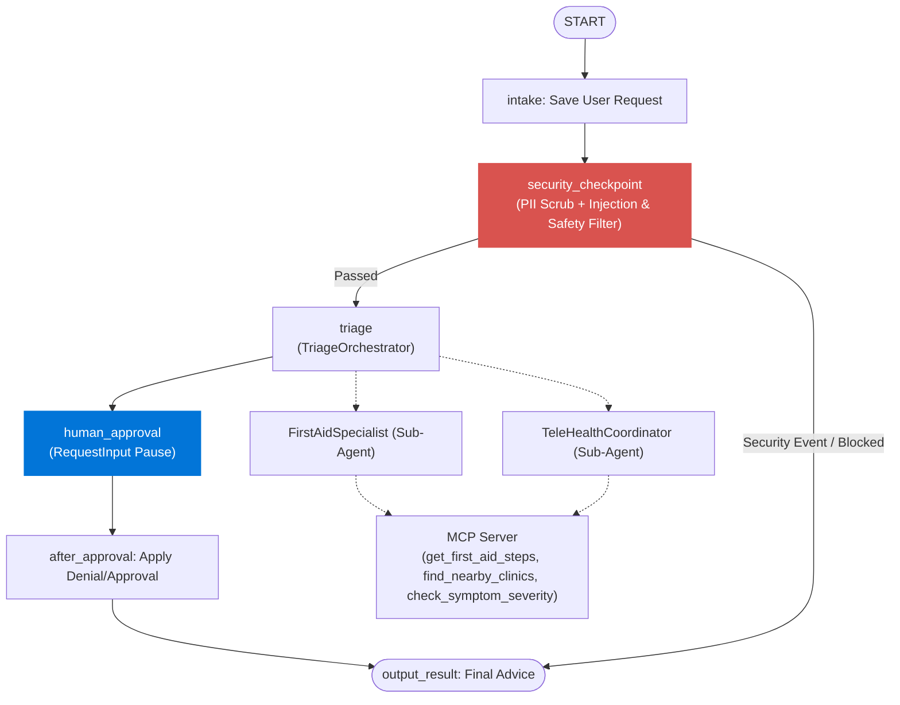

# HealthLink Agent — Submission Write-Up

## Problem Statement

When individuals experience unexpected physical symptoms or minor injuries, they often struggle to find immediate, accurate, and safe medical guidance. They may resort to search engines (which can cause unnecessary anxiety or misdiagnose issues) or visit crowded urgent care centers and emergency rooms for non-life-threatening concerns. 

There is a critical need for a secure, multi-agent triage system that provides reliable, localized first aid information and telehealth coordination, while strictly adhering to safety filters, PII sanitization, prompt injection safeguards, and optional human reviewer controls.

---

## Solution Architecture

The following diagram illustrates the flow of a user query through the HealthLink Agent workflow:

---

## Concepts Used

This project leverages the key architectural capabilities of the **Google Agent Development Kit (ADK)**:

1. **ADK 2.0 Workflow**: The core pipeline is constructed as an event-driven directed graph using `Workflow`, `START`, and `FunctionNode` classes inside [agent.py](file:///e:/projects/capstone_project/healthlink-agent/app/agent.py#L115-L123).
2. **Multi-Agent Coordination & Delegation**:
   - `TriageOrchestrator` orchestrates the top-level plan using `AgentTool` definitions for the specialized sub-agents [agent.py](file:///e:/projects/capstone_project/healthlink-agent/app/agent.py#L47-L61).
   - `FirstAidSpecialist` and `TeleHealthCoordinator` execute targeted domain-specific goals [agent.py](file:///e:/projects/capstone_project/healthlink-agent/app/agent.py#L25-L45).
3. **Model Context Protocol (MCP)**:
   - Exposes tools to retrieve dynamic data from local resources using the standard Stdio server protocol.
   - Built inside [mcp_server.py](file:///e:/projects/capstone_project/healthlink-agent/app/mcp_server.py).
   - Consumed by sub-agents using `MCPToolset` configured in [agent.py](file:///e:/projects/capstone_project/healthlink-agent/app/agent.py#L14-L19).
4. **Security Checkpoint Node**:
   - A dedicated workflow node (`security_checkpoint`) intercepting inputs to handle prompt injection mitigations and redact sensitive PII [agent.py](file:///e:/projects/capstone_project/healthlink-agent/app/agent.py#L66-L95).
5. **Agents CLI**:
   - Built and managed using the `agents-cli` framework for standard environments and cloud deployments [pyproject.toml](file:///e:/projects/capstone_project/healthlink-agent/pyproject.toml).

---

## Security Design

Medical applications demand strict safety and privacy controls. HealthLink Agent enforces these controls upstream before any LLM is queried:

* **PII Sanitization**: We use regular expressions to scrub phone numbers (e.g. `123-456-7890`) and Social Security Numbers (SSNs) into generic tokens (`[REDACTED PHONE]`, `[REDACTED SSN]`). This prevents accidental leakage of patient identity to external model endpoints.
* **Prompt Injection Detection**: Inputs containing keywords designed to override system directives (such as `"ignore previous"`, `"system prompt"`, `"bypass"`, or `"override"`) trigger an immediate routing detour to `output_result`, completely bypassing the orchestrator and returning a standard security response.
* **Safety Keyword Filter**: High-severity safety flags (such as `"suicide"`) bypass the triage system and direct the user to immediate emergency services.
* **Structured Audit Logging**: Security evaluations publish structured JSON output summarizing events, enabling seamless integrations with log monitoring tools (like Google Cloud Logging or ELK Stack).

---

## MCP Server Design

The Model Context Protocol (MCP) server acts as a structured bridge between LLMs and local or remote medical databases:

1. `find_nearby_clinics`: Takes a `zip_code` and returns local primary and urgent care clinic names. Helps the `TeleHealthCoordinator` guide patients to real-world resources.
2. `get_first_aid_steps`: Takes a `condition` name and returns safe, standardized first-aid actions. Ensures the `FirstAidSpecialist` references a trusted, deterministic playbook.
3. `check_symptom_severity`: Evaluates symptoms to flag potential severity and request human or doctor intervention.

---

## Human-in-the-Loop (HITL) Flow

To prevent hallucinated advice from reaching a patient, the workflow integrates a human-in-the-loop checkpoint using ADK's `RequestInput`:

1. After the Orchestrator prepares the final advice, the workflow stops at `human_approval`.
2. A human operator/coordinator reviews the advice in the playground or console.
3. If approved (`approve`), the workflow proceeds to output the generated advice.
4. If denied (`deny`), the system replaces the output with a notification that the advice was rejected by the reviewer.

---

## Demo Walkthrough

We demonstrate the system using three specific test pathways:

1. **Path A (Normal Path - First Aid)**: A user submits a query about a minor burn. The security check passes. The orchestrator routes to the FirstAidSpecialist, who retrieves instructions from the MCP server. A reviewer approves the workflow, and the advice is delivered.
2. **Path B (Security Path - Injection)**: A user submits a query attempting to hijack the prompt. The security checkpoint catches the words `"ignore previous"` and aborts, outputting a security warnings screen.
3. **Path C (Emergency Path)**: A user mentions a self-harm related term. The safety filter halts the agent flow and displays emergency numbers.

---

## Impact & Value Statement

HealthLink Agent provides a scalable, secure, and compliant template for digital health triage. By automatically redacting PII, deflecting malicious injections, and integrating human validation before output, this solution provides a safe blueprint for healthcare providers seeking to reduce triage bottle-necks, lowering patient load on physical clinics while ensuring user safety.
